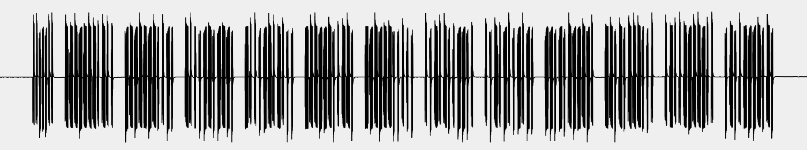
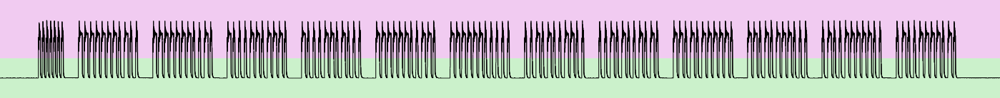
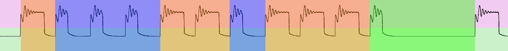

 

# Protocol documentation (work in progress)

## Properties

| Property                      | Value             |
| ----------------------------- | ----------------- |
| Product name                  | FernoTron         |
| Frequency                     | 433,92 MHz        |
| Modulation                    | ASK (OOK)         |
| Bit length                    | 400µs             |
| Bits per symbol               | 3 or 8 bits       |
| Pause between blocks          | 3,2ms (8 bit)     |
| Pause between messages        | ~ 60ms (148 bits) |
| Encryption / Authentication   | None              |
| Communication characteristics | Unidirectional    |

## General functionality

## Physical layer

The basic characteristics of the signal can be found in the properties table. The beginning of each message is introduced by a preamble. It is a 12 bit long repeating sequence of 1 and 0.  After the preamble 12 blocks follow which are interrupted by pauses. A block is 30 bit (12ms) long and ends with a pause of 8 bit.
*Figure [1]* shows the analog waveform of a FernoTron message:

*Figure [2]* shows the same message, except that it has already been demodulated. More precisely, the restored digital signal is shown here, which includes the appropriate information of the message in binary form. 

Note that these bits do not directly correspond to the actual transmitted data! Multiple bits correspond to a single symbol. In total there are 3 different symbols as shown in the table and figure below. The symbols represent the actual information of the message. Since a block is 30 bits long, 10 symbols (actual data bits) can be transmitted per block. This means that 120 symbols (data bits) are transmitted per message. 

| Bits     | Symbol |
| -------- | ------ |
| 100      | 1      |
| 110      | 0      |
| 10000000 | Pause  |

*Figure [3]* shows the conversion from bits to symbols of a message block. Orange represents the symbol *0* and blue the symbol *1*. Green shows the *Pause* symbol between the individual blocks.

## Logic / Application layer

Pressing a button on the original FernoTron remote control briefly transmits two messages. If the button is held down, messages are transmitted continuously. 

## Application layer

