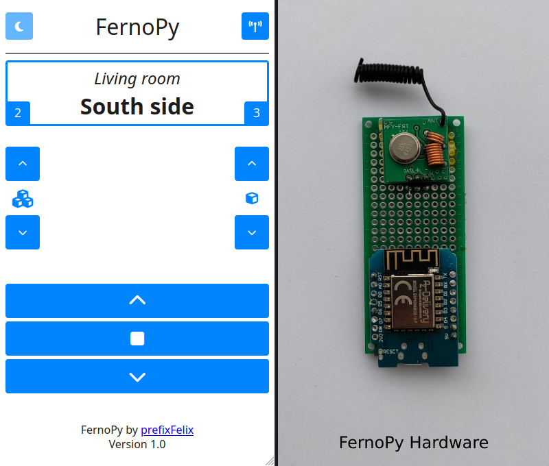

<p align="center">

</p>
<h1 align="center">FernoPy</h1>

**FernoPy** enables the control of Rademacher FernoTron devices (shutters) conveniently via a web interface and REST-API.

## Features

- Responsive web interface
- REST-API (Home Assistant, ioBroker, openHAB support)
- Unlimited number of devices
- The original FernoTron remote control can be used alongside FernoPy
- Quick and easy to set up
- Cheap (total cost of only 10€)
- Covers a whole medium-sized house
- ESP32 / ESP8266 support
- Written in MicroPython
- **[Protocol documentation](PROTOCOL.md)**

> :information_source: Only the basic control of devices is supported (up / down / stop). If you want to program devices please use: [tronferno-mcu](https://github.com/zwiebert/tronferno-mcu)

## Overview

<p align="center">

</p>

The web interface (left figure) is provided directly via the web server of the ESP. The design and functionality of the interface is based on the original FernoTron remote control. 

- The upper left button switches between light and dark mode (*dark mode is not yet implemented*)
- The upper right button is used to switch between multiple remote controls. You can configure as many remote controls as you like, allowing you to control an unlimited number of devices via FernoPy. However, the maximum number of groups and participants per remote control still exist in FernoPy (7 groups with 7 devices each). 
- The left two buttons control the group number and the right ones the device number (**also called member**). Each group and device can be assigned a name.
- The lower three buttons are used to control the shutters. 

### REST-API

FernoPy can be integrated into other programs by using its REST-API. This allows you to connect the shutters to central smart home systems such as Home Assistant, ioBroker or openHAB.

#### `/api/config`

This URI can be used to query all available remote controls with their groups and the respective devices by using the GET method. To be more precise: The data of the *fernotron* dictionary in the *tx_config.py* file is returned (without the device types and id). 

```shell
$ curl -X GET http://<YOUR_ESP_IP>/api/config
{"remotes": [
	[
		{"name": "All", "members": ["All"]}, 
		{'name': 'Living room', 'members': ['All', 'North', 'East', 'South', 'West']},
		...
	], 
	[
		...
	],
]}
```

#### `/api/cmd`


This URI can be used to transmit control messages to the shutters by using the POST method. Requests with the content-type `application/json` and `application/x-www-form-urlencoded` are supported. Group and member numbers 0-7, where 0 represents all. The available commands are up, down and stop.

```shell
# application/json
$ curl -d '{"remote":0, "member":2, "group":5, "cmd":"down"}' -H "Content-Type: application/json" -X POST http://<YOUR_ESP_IP>/api/cmd

# application/x-www-form-urlencoded
$ curl -d 'remote=0&member=2&group=5&cmd="down"' -X POST http://<YOUR_ESP_IP>/api/cmd
```

## Hardware requirements

You only need an ESP32 / ESP8266 and a 433 MHz transmitter + receiver set. The functionality of FernoPy was tested with a Wemos D1 mini clone and the cheapest transmitter + receiver set from amazon.

| Part                           | Amazon query                                        | Cost | Specific type                 | Data sheet                                                   |
| ------------------------------ | --------------------------------------------------- | ---- | ----------------------------- | ------------------------------------------------------------ |
| 433 MHz receiver + transmitter | [DE](https://www.amazon.de/s?k=433+mhz+transmitter) | 2€   | XY-MK-5V / XD-RF-5V / FS1000A | [Archive](https://web.archive.org/web/20231016150458/https://www.mantech.co.za/datasheets/products/HFY-J18_HFY-FST.pdf) |
| Wemos D1 mini (ESP8266)        | [DE](https://www.amazon.de/s?k=wemos+d1+mini)       | 4€   | -                             | [Archive](https://web.archive.org/web/20230316032550/https://www.wemos.cc/en/latest/d1/d1_mini.html) |

When buying the transmitter + receiver set, there is something to consider:  
The transmitters in each set are basically the same and all work equally well. However, there are differences with the receivers. There are ones with a tunable inductor (small coil with a screw) and ones with a crystal oscillator (small metallic box). Receivers with a tunable inductor have a greater noise component, which makes it more difficult to receive a valid messages. 
However, testing has shown that these are sufficient for FernoPy, especially considering that the receiver is only needed once for the initial setup and not for normal operation. Receivers with a crystal oscillator (also called superheterodyne) can nevertheless simplify the initiation phase in some cases.

## Installation Linux (recommended)

<details open>
  <summary>Click to see the complete installation instructions</summary>

### 0. Flash MicroPython

Before FernoPy can be installed, the MicroPython firmware must be flashed onto the micro controller. If MicroPython is already running on your micro controller you can skip this step. A more detailed tutorial can be found [here](https://docs.micropython.org/en/latest/esp8266/tutorial/intro.html).

1. Install the [esptool](https://github.com/espressif/esptool/) CLI. 

   ```shell
   pip install esptool
   ```

2. Download the appropriate firmware for the micro controller [here](https://micropython.org/download/). The file must be in binary format (.bin).

3. Connect the micro controller to your PC.

4. Now find out which device file is used to communicate with the micro controller. By default it should be `/dev/ttyUSB0`. Alternatively, you can also determine it via the command: `sudo dmesg | grep tty`. The output should look similar like this and give you information about the used file.

   ```shell
   $ sudo dmesg | grep tty
   [435144.714226] usb 1-1: ch341-uart converter now attached to ttyUSB0
   ```

5. Erase the flash of the micro controller.

   ```shell
   esptool.py --port /dev/ttyUSB0 erase_flash
   ```

6. Flash the MicroPython firmware.

   ```shell
   esptool.py --port /dev/ttyUSB0 --baud 460800 write_flash --flash_size=detect -fm dout 0 ESP8266_GENERIC-20231005-v1.21.0.bin
   ```

   Port and the name of the firmware should of course be changed by you as needed.

### 1. Obtain the device ID

#### 1.1 Prepare FernoPy

1. Install the [mpremote](https://docs.micropython.org/en/latest/reference/mpremote.html) CLI.

   ```shell
   pip install --user mpremote
   ```

2. Clone the FernoPy repository.

   ```
   git clone https://github.com/prefixFelix/fernopy.git
   ```

3. Connect the micro controller to your PC.

4. Verify that MicroPython is running properly on your micro controller by accessing the REPL prompt.

   ```
   mpremote connect /dev/ttyUSB0 repl
   ```

#### 1.2 Sniff the device ID

The shutters are normally controlled by a 2411 Rademacher remote control. The remote has a unique identification number, which is required for the operation of FernoPy.

1. Connect the micro controller to the 433 MHz receiver as shown below:

   | Micro controller | 433 MHz receiver |
   | ---------------- | ---------------- |
   | GND              | GND              |
   | 5V               | VCC              |
   | GPIO5            | DATA             |

   GPIO5 is the standard pin for the data connection. If you want to use another one you have to change it in the file `/src/rx/rx_config.py`. 

2. Connect the micro controller to your PC.

3. Run the sniffing install script and follow the given instructions.
   ```shell
   python3 1-rx-install.py /dev/ttyUSB0
   ```
   
   > :warning: The recording should ideally not take place in the vicinity of possible sources of interference, such as radio weather stations that also transmit on 433 MHz. The distance between the PC and the micro controller should also be maximized for the same reason (what the USB cable can offer).  Also micro controller and receiver should not be next to each other. **Compare your setup with [this illustration](img/setup.png)**.
   
   > :warning: The antenna of the receiver should be parallel to the left side of the remote control. Vertically, the antenna should be in the lower third to half of the remote control. The distance between the remote control and the antenna should be as small as possible (they can also touch each other). **Compare your placement with [this illustration](img/remote.png)**.
   
   > :information_source: If the recording does not work even after multiple position changes, you can activate the *debug* settings in the config file and alter the *margin* value. For the changes to take effect, the install script must be rerun.
   
   > :information_source: If a `MemoryError` occurs you can reduce the *n_edges* value in the config. You may also need to enable *debug* output there. 

##### Alternative: Sniff via an SDR and Universal Radio Hacker (For experienced users)

If you have a SDR on hand, such as an RTL-SDR, you can also sniff the ID by using the software [Universal Radio Hacker](https://github.com/jopohl/urh). You can find a prepared project in the `urh` folder. It contains predefined message types and a custom decoder for the FernoTron protocol. The program also allows you to better understand the protocol structure.

### 2. Install FernoPy

1. Open the tx configuration file in an editor of your choice.
   ```
   nano /src/tx/tx_config.py
   ```

   Enter the ESSID of your home network and the password in the general dict.
   ```python
   # General device configuration
   general = {
       'symbol_length': 350,           # in µs
       'tx_pin': 5,                    # GPIO!
       'tx_repeat': 4,                 # MSGs transmitted per command
       'essid': 'YOUR_NETWORK_ESSID',
       'password': 'YOUR_NETWORK_PASSWORD',
       'html_assets': 'assets'         # Path to web assets
   }
   ```

   > :information_source: The symbol length of FernoTron is actually 400µs, but 350µs are used because of the latency of the MC. You may have to adjust this value.
   
   Next, the configuration of your FernoTron remote control must be entered into the fernotron list. Start by entering for each remote the type and id you got from the previous step.
   ```python
   fernotron = [
       {
           # Remote 0
           'device_type': 0x80,    # Add information from the RX scipt here!
           'device_id': 0x1234,	# Add information from the RX scipt here!
   		...
   ```
   
   Now enter all groups and their devices with their respective names. The index of the groups and devices corresponds to that of the remote control.
   
   > :warning: The first group of a remote control is always the *All* group! This must not be removed! Likewise, the first device of a group (index 0) must always be *All*! You can translate the name into your own language if you wish.
   
   ```python
   ...		
   		'groups': [
               {
                   # Default group. Do not remove!
                   'name': 'All',
                   'members': ['All']
               },
               {
                   # Group 1 - Example
                   'name': 'Living room',                          		# Group name
                   'members': ['All', 'North', 'East', 'South', 'West']	# Group member names
               },
               {   # Group 2 - Example
                   'name': 'Kitchen',
                   'members': ['All', 'Street', 'Garden']
               },
   			...
   ```

2. Connect the micro controller to the 433 MHz **transmitter** as as described above in section 1.2.

3. Connect the micro controller to your PC.

4. Run the FernoPy install script.
   ```shell
   python3 2-tx-install.py /dev/ttyUSB0
   ```
   
5. Open the web interface by entering the displayed IP in your browser.

   > :information_source: You can save a short cut to FernoPy on the home screen of your smart phone. Instructions can be found [here](https://www.androidauthority.com/add-website-android-iphone-home-screen-3181682/).

</details>

## Installation Windows
<details>
  <summary>Click to see the complete installation instructions</summary>

### 0. Flash MicroPython

Before FernoPy can be installed, the MicroPython firmware must be flashed onto the micro controller. If MicroPython is already running on your micro controller you can skip this step. A more detailed tutorial can be found [here](https://docs.micropython.org/en/latest/esp8266/tutorial/intro.html).

0. Make sure that [Python](https://www.python.org/downloads/) and pip (`py -m ensurepip --upgrade`) are installed!

1. Open CMD and Install the [esptool](https://github.com/espressif/esptool/) CLI. 

   ```shell
   py -m pip install esptool
   ```

2. Download the appropriate firmware for the micro controller [here](https://micropython.org/download/). The file must be in binary format (.bin).

3. Connect the micro controller to your PC.

4. Open the Windows Device Manager to find out which port the micro controller is using. It should be listed under the item *Ports (COM & LPT)*.

5. Erase the flash of the micro controller.

   ```shell
   py -m esptool.py --port COM4 erase_flash
   ```

6. Flash the MicroPython firmware.

   ```shell
   py -m esptool.py --port COM4 --baud 460800 write_flash --flash_size=detect -fm dout 0 ESP8266_GENERIC-20231005-v1.21.0.bin
   ```

   Port and the name of the firmware should of course be changed by you as needed.

### 1. Obtain the device ID

#### 1.1 Prepare FernoPy

1. Install the [mpremote](https://docs.micropython.org/en/latest/reference/mpremote.html) CLI.

   ```shell
   py -m pip install --user mpremote
   ```

2. Clone or download the FernoPy repository.

   ```shell
   git clone https://github.com/prefixFelix/fernopy.git
   ```

3. Connect the micro controller to your PC.

4. Verify that MicroPython is running properly on your micro controller by accessing the REPL prompt.

   ```shell
   py -m mpremote connect COM4 repl
   ```

#### 1.2 Sniff the device ID

The shutters are normally controlled by a 2411 Rademacher remote control. The remote has a unique identification number, which is required for the operation of FernoPy.

1. Connect the micro controller to the 433 MHz receiver as shown below:

   | Micro controller | 433 MHz receiver |
   | ---------------- | ---------------- |
   | GND              | GND              |
   | 5V               | VCC              |
   | GPIO5            | DATA             |

   GPIO5 is the standard pin for the data connection. If you want to use another one you have to change it in the file `/src/rx/rx_config.py`. 

2. Connect the micro controller to your PC.

3. Run the sniffing install script and follow the given instructions.
   ```shell
   py 1-rx-install.py COM4
   ```

   > :warning: The recording should ideally not take place in the vicinity of possible sources of interference, such as radio weather stations that also transmit on 433 MHz. The distance between the PC and the micro controller should also be maximized for the same reason (what the USB cable can offer).  Also micro controller and receiver should not be next to each other. **Compare your setup with [this illustration](img/setup.png)**.

   > :warning: The antenna of the receiver should be parallel to the left side of the remote control. Vertically, the antenna should be in the lower third to half of the remote control. The distance between the remote control and the antenna should be as small as possible (they can also touch each other). **Compare your placement with [this illustration](img/remote.png)**.

   > :information_source: If the recording does not work even after multiple position changes, you can activate the *debug* settings in the config file and alter the *margin* value. For the changes to take effect, the install script must be rerun.

   > :information_source: If a `MemoryError` occurs you can reduce the *n_edges* value in the config. You may also need to enable *debug* output there. 

##### Alternative: Sniff via an SDR and Universal Radio Hacker (For experienced users)

If you have a SDR on hand, such as an RTL-SDR, you can also sniff the ID by using the software [Universal Radio Hacker](https://github.com/jopohl/urh). You can find a prepared project in the `urh` folder. It contains predefined message types and a custom decoder for the FernoTron protocol. The program also allows you to better understand the protocol structure.

### 2. Install FernoPy

1. Open the tx configuration file `/src/tx/tx_config.py`.

   Enter the ESSID of your home network and the password in the general dict.
   
   ```python
   # General device configuration
   general = {
       'symbol_length': 350,           # in µs
       'tx_pin': 5,                    # GPIO!
       'tx_repeat': 4,                 # MSGs transmitted per command
       'essid': 'YOUR_NETWORK_ESSID',
       'password': 'YOUR_NETWORK_PASSWORD',
       'html_assets': 'assets'         # Path to web assets
   }
   ```
   
   > :information_source: The symbol length of FernoTron is actually 400µs, but 350µs are used because of the latency of the MC. You may have to adjust this value.
   
   Next, the configuration of your FernoTron remote control must be entered into the fernotron list. Start by entering for each remote the type and id you got from the previous step.

   ```python
   fernotron = [
       {
           # Remote 0
           'device_type': 0x80,    # Add information from the RX scipt here!
           'device_id': 0x1234,	# Add information from the RX scipt here!
   		...
   ```
   
   Now enter all groups and their devices with their respective names. The index of the groups and devices corresponds to that of the remote control.
   
   > :warning: The first group of a remote control is always the *All* group! This must not be removed! Likewise, the first device of a group (index 0) must always be *All*! You can translate the name into your own language if you wish.

   ```python
   ...		
   		'groups': [
               {
                   # Default group. Do not remove!
                   'name': 'All',
                   'members': ['All']
               },
               {
                   # Group 1 - Example
                   'name': 'Living room',                          		# Group name
                   'members': ['All', 'North', 'East', 'South', 'West']	# Group member names
               },
               {   # Group 2 - Example
                   'name': 'Kitchen',
                   'members': ['All', 'Street', 'Garden']
               },
   			...
   ```
   
2. Connect the micro controller to the 433 MHz **transmitter** as as described above in section 1.2.

3. Connect the micro controller to your PC.

4. Run the FernoPy install script `2-tx-install.bat`.
   ```sell
   py 2-tx-install.py COM4
   ```

5. Open the web interface by entering the displayed IP in your browser.
   > :information_source: You can save a short cut to FernoPy on the home screen of your smart phone. Instructions can be found [here](https://www.androidauthority.com/add-website-android-iphone-home-screen-3181682/).

</details>

## Credits

Protocol documentation - [tronferno-mcu (Bert Winkelmann)](https://github.com/zwiebert/tronferno-mcu)  
Web server - [Nanoweb (Charles R.)](https://github.com/hugokernel/micropython-nanoweb)  
Signal processing - [Micropython Remote (Peter Hinch)](https://github.com/peterhinch/micropython_remote)  
Logo - [Flaticon](https://www.flaticon.com/free-icons)

